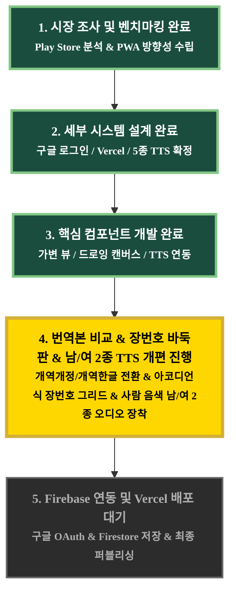

# 🎯 프로젝트 마일스톤 및 세부 작업 현황 (task.md)

## 📌 전체 마일스톤 흐름도 (Milestone Visual Map)

> **안내**: 어두운(Black) 테마 에디터 환경에서도 글씨와 진행 상태를 한눈에 가장 선명하게 파악하실 수 있도록 고대비 컬러 시스템과 큼직한 박스 테두리로 시각화 설계되었습니다.

---

## 📋 세부 작업 진행 현황 (Task Checklist)

### 🟢 [Task 1] PWA 핵심 뼈대 구성 및 글자 제어 뷰 (TDD) - ✅ 완료
- [x] Step 1: PWA 및 3단계 폰트 가변 HTML 골격 작성 (`index.html`)
- [x] Step 2: 3단계 가변 테마 CSS 작성 (`style.css`)
- [x] Step 3: 테스트 구동 및 폰트 변경 검증 (`test/task1_spec.js`)

### 🟢 [Task 2] 손글씨 드로잉 캔버스 및 수동 완료 버튼 구현 (TDD) - ✅ 완료
- [x] Step 1: HTML5 캔버스 마크업 추가 (`index.html`)
- [x] Step 2: 붓 그리기 및 수동 완료 트리거 스크립트 구현 (`canvas-drawing.js`)
- [x] Step 3: 필사 캔버스 그리기 수동 검증

### 🟢 [Task 3] 구절별 재생 및 실시간 강조(Highlighting) 오디오 구현 (TDD) - ✅ 완료
- [x] Step 1: 하이라이트 대응형 구절 마크업 및 재생 버튼 추가 (`index.html`)
- [x] Step 2: Web Speech API 연계 구절 실시간 강조 스크립트 작성 (`bible-tts.js`)
- [x] Step 3: 오디오 실시간 하이라이팅 연동 검증

### 🟡 [Task 4] 성경 데이터 대대적 개편 & 아코디언식 장번호 & 고품질 AI TTS & 백그라운드 낭독 & 다음 장 이어서 자동 재생 (TDD) - ⏳ 진행 중
- [x] Step 1: 개역개정 4판 및 개역한글 최신판 2대 성경 번역본 실시간 전환 기능 구현 (완료)
- [x] Step 2: 구약/신약 66권 클릭 시 하위에 스무스하게 열리는 아코디언식 장번호 바둑판 버튼판(`1`, `2` ... `끝장`) 돔 렌더링 (완료)
- [ ] Step 3: 기계음 배제 및 고품질 AI 자연어 한국어 남/여 2종(Natural Online Voice) 매핑 엔진 개편
- [ ] Step 4: 휴대폰 화면이 꺼져도 연속 낭독되도록 Media Session API 및 Silent Audio Wake Lock 무음 트랙 루프 연동
- [ ] Step 5: 장 내 1절~끝절 낭독 시 멈춤 없는 연속 큐 및 장 끝 도달 시 다음 장(Chapter) 자동 이어서 낭독 구현
- [x] Step 6: 66권 전체 성경 JSON 데이터 로더 스크립트 구축 및 365 묵상 데이터 통합 로직 작성 (완료)
- [ ] Step 7: 성경 읽기 ↔ 필사(타이핑/손글씨) ↔ 퀴즈 기능 간의 실시간 연계 데이터 합체 구동 검증

### ⚪ [Task 5] Firebase 구글 로그인 연동 및 Vercel 배포 (TDD) - ⏳ 대기 중
- [ ] Step 1: Firebase Auth 구글 팝업 인증 모듈 개발
- [ ] Step 2: Firestore 데이터 백업 및 진행도 로컬/클라우드 양방향 동기화 연동
- [ ] Step 3: Vercel Production 배포 및 최종 PWA 작동 검증
